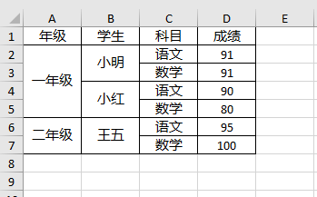
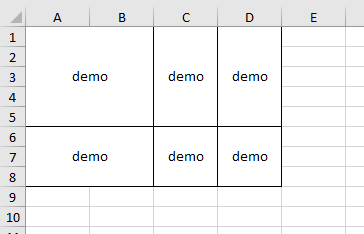

# Laravel Excel Merge Cell

基于 `maatwebsite/excel` 导出Excel，在生成工作表后，合并单元格。

## Excel合并单元格
### 用法

合并单元格在`afterSheet`事件中执行，调用 `Mergenable::afterSheet($event);` 即可。

```php
<?php

namespace App\Exports;

use App\User;
use Maatwebsite\Excel\Concerns\FromCollection;
use Maatwebsite\Excel\Concerns\RegistersEventListeners;
use Maatwebsite\Excel\Concerns\WithEvents;
use Maatwebsite\Excel\Events\AfterSheet;
use Slpi1\Excel\Mergenable;

class DemoExport implements FromCollection, WithEvents
{
    use RegistersEventListeners;
    /**
     * @return \Illuminate\Support\Collection
     */
    public function collection()
    {
        return User::all();
    }

    public static function afterSheet(AfterSheet $event)
    {
        Mergenable::afterSheet($event);
    }

}
```

### 自定义合并规则
如果要自定义合并规则，需要导出类继承接口 `Slpi1\Excel\Concerns\WithStopRule`，实现其中的 `stopColumns/stopRows` 两个方法。方法表示的含义是，当合并进行到某行或某列时，是否需要停止，方法可以返回以下类型：

- Boolean: 当值为 `true` 时，表示不进行合并（任意行/列都停止）;当值为 `false` 时，表示取相邻值相等的单元格合并。
- Array: 表示需要停止的数据所在索引，0为索引第一个值，对于 `stopColumns` 方法，返回的数组元素还可以是Excel的行号，如:['A', 'D']，表示合并遇到 `A/D` 两列自动停止。
- Callable: 还可以返回一个匿名函数，`stopColumns` 方法返回的函数函数签名为 `function($x, $y){}`，`stopRows` 方法返回的函数函数签名为 `function($y, $x){}`

```php
<?php

namespace App\Exports;

use App\User;
use Maatwebsite\Excel\Concerns\FromCollection;
use Maatwebsite\Excel\Concerns\RegistersEventListeners;
use Maatwebsite\Excel\Concerns\WithEvents;
use Maatwebsite\Excel\Events\AfterSheet;
use Slpi1\Excel\Concerns\WithStopRule;
use Slpi1\Excel\Mergenable;

class DemoExport implements FromCollection, WithEvents, WithStopRule
{
    use RegistersEventListeners;
    /**
     * @return \Illuminate\Support\Collection
     */
    public function collection()
    {
        return collect([
            ['demo', 'demo', 'demo', 'demo'],
            ['demo', 'demo', 'demo', 'demo'],
            ['demo', 'demo', 'demo', 'demo'],
            ['demo', 'demo', 'demo', 'demo'],
            ['demo', 'demo', 'demo', 'demo'],
            ['demo', 'demo', 'demo', 'demo'],
            ['demo', 'demo', 'demo', 'demo'],
            ['demo', 'demo', 'demo', 'demo'],
        ]);
    }

    public static function afterSheet(AfterSheet $event)
    {
        Mergenable::afterSheet($event);
    }

    public function stopColumns()
    {
        return ['C', 'D'];
    }

    public function stopRows()
    {
        return [5];
    }
}
```

导出`Excel`数据如下：



### 继承停止行/列

继承停止行是指前列合并后，会影响后列的合并判定，即后列的合并不会跨过前列的开始行与结束行。要启用继承停止行/列，只需要导出类使用 `trait` 类 `ExtendStopRows/ExtendStopColumns`。

```php
<?php
namespace App\Exports;

use Maatwebsite\Excel\Concerns\FromCollection;
use Maatwebsite\Excel\Concerns\RegistersEventListeners;
use Maatwebsite\Excel\Concerns\WithEvents;
use Maatwebsite\Excel\Events\AfterSheet;
use Slpi1\Excel\Concerns\ExtendStopRows;
use Slpi1\Excel\Mergenable;

class DemoExport implements FromCollection, WithEvents
{
    use RegistersEventListeners, ExtendStopRows;
    /**
     * @return \Illuminate\Support\Collection
     */
    public function collection()
    {
        return collect([
            ['年级', '学生', '科目', '成绩'],
            ['一年级', '小明', '语文', 91],
            ['一年级', '小明', '数学', 91],
            ['一年级', '小红', '语文', 90],
            ['一年级', '小红', '数学', 80],
            ['二年级', '王五', '语文', 95],
            ['二年级', '王五', '数学', 100],
        ]);
    }

    public static function afterSheet(AfterSheet $event)
    {
        Mergenable::afterSheet($event);
    }
}
```

导出`Excel`数据如下：



## 导出为Table原型

如果有需要在web上展示表格且需要进行单元格的合并时，也可以生成表格数据的原型。

- 先定义一个数据源 `Demo` 对象，对象拥有属性 `data` 表示原始数据，对象继承 `Slpi1\Excel\TableMergenable`。

```php
<?php

namespace App;

class Demo extends TableMergenable
{
    public $data = [
        ['年级', '学生', '科目', '成绩'],
        ['一年级', '小明', '语文', 91],
        ['一年级', '小明', '数学', 91],
        ['一年级', '小红', '语文', 90],
        ['一年级', '小红', '数学', 80],
        ['二年级', '王五', '语文', 95],
        ['二年级', '王五', '数学', 100],
    ];
}
```

- 获取数据原型

```php

use App\Demo;

$tbody = (new Demo)->tbody();
print_r($tbody);
```

打印出的数据如下：
```
Array
(
    [0] => Array
        (
            [key] => 0
            [0] => Array
                (
                    [value] => 年级
                    [colSpan] => 1
                    [rowSpan] => 1
                )

            [1] => Array
                (
                    [value] => 学生
                    [colSpan] => 1
                    [rowSpan] => 1
                )

            [2] => Array
                (
                    [value] => 科目
                    [colSpan] => 1
                    [rowSpan] => 1
                )

            [3] => Array
                (
                    [value] => 成绩
                    [colSpan] => 1
                    [rowSpan] => 1
                )

        )

    [1] => Array
        (
            [key] => 1
            [0] => Array
                (
                    [value] => 一年级
                    [colSpan] => 1
                    [rowSpan] => 4
                )

            [1] => Array
                (
                    [value] => 小明
                    [colSpan] => 1
                    [rowSpan] => 2
                )

            [2] => Array
                (
                    [value] => 语文
                    [colSpan] => 1
                    [rowSpan] => 1
                )

            [3] => Array
                (
                    [value] => 91
                    [colSpan] => 1
                    [rowSpan] => 2
                )

        )

    [2] => Array
        (
            [key] => 2
            [0] => Array
                (
                    [value] => 一年级
                    [colSpan] => 0
                    [rowSpan] => 0
                )

            [1] => Array
                (
                    [value] => 小明
                    [colSpan] => 0
                    [rowSpan] => 0
                )

            [2] => Array
                (
                    [value] => 数学
                    [colSpan] => 1
                    [rowSpan] => 1
                )

            [3] => Array
                (
                    [value] => 91
                    [colSpan] => 0
                    [rowSpan] => 0
                )

        )

    [3] => Array
        (
            [key] => 3
            [0] => Array
                (
                    [value] => 一年级
                    [colSpan] => 0
                    [rowSpan] => 0
                )

            [1] => Array
                (
                    [value] => 小红
                    [colSpan] => 1
                    [rowSpan] => 2
                )

            [2] => Array
                (
                    [value] => 语文
                    [colSpan] => 1
                    [rowSpan] => 1
                )

            [3] => Array
                (
                    [value] => 90
                    [colSpan] => 1
                    [rowSpan] => 1
                )

        )

    [4] => Array
        (
            [key] => 4
            [0] => Array
                (
                    [value] => 一年级
                    [colSpan] => 0
                    [rowSpan] => 0
                )

            [1] => Array
                (
                    [value] => 小红
                    [colSpan] => 0
                    [rowSpan] => 0
                )

            [2] => Array
                (
                    [value] => 数学
                    [colSpan] => 1
                    [rowSpan] => 1
                )

            [3] => Array
                (
                    [value] => 80
                    [colSpan] => 1
                    [rowSpan] => 1
                )

        )

    [5] => Array
        (
            [key] => 5
            [0] => Array
                (
                    [value] => 二年级
                    [colSpan] => 1
                    [rowSpan] => 2
                )

            [1] => Array
                (
                    [value] => 王五
                    [colSpan] => 1
                    [rowSpan] => 2
                )

            [2] => Array
                (
                    [value] => 语文
                    [colSpan] => 1
                    [rowSpan] => 1
                )

            [3] => Array
                (
                    [value] => 95
                    [colSpan] => 1
                    [rowSpan] => 1
                )

        )

    [6] => Array
        (
            [key] => 6
            [0] => Array
                (
                    [value] => 二年级
                    [colSpan] => 0
                    [rowSpan] => 0
                )

            [1] => Array
                (
                    [value] => 王五
                    [colSpan] => 0
                    [rowSpan] => 0
                )

            [2] => Array
                (
                    [value] => 数学
                    [colSpan] => 1
                    [rowSpan] => 1
                )

            [3] => Array
                (
                    [value] => 100
                    [colSpan] => 1
                    [rowSpan] => 1
                )

        )

)

```
